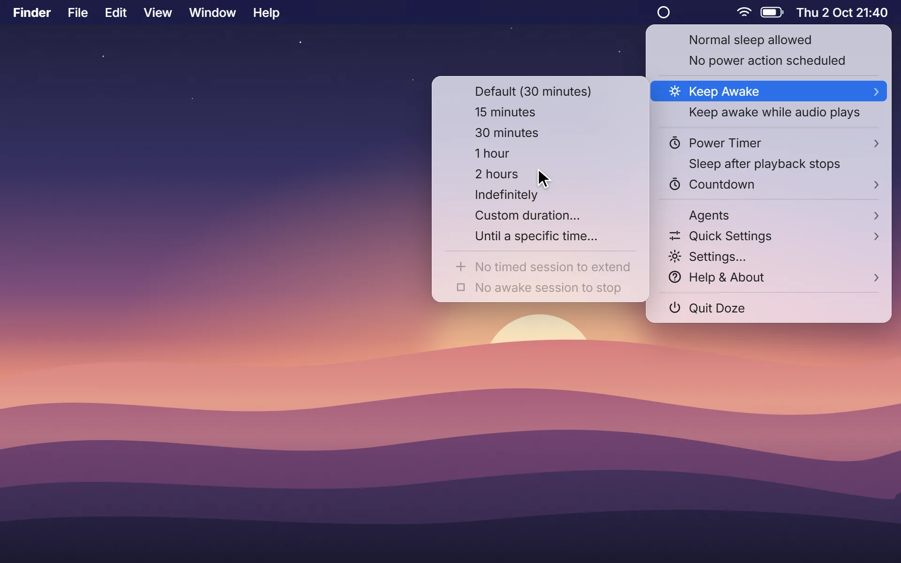
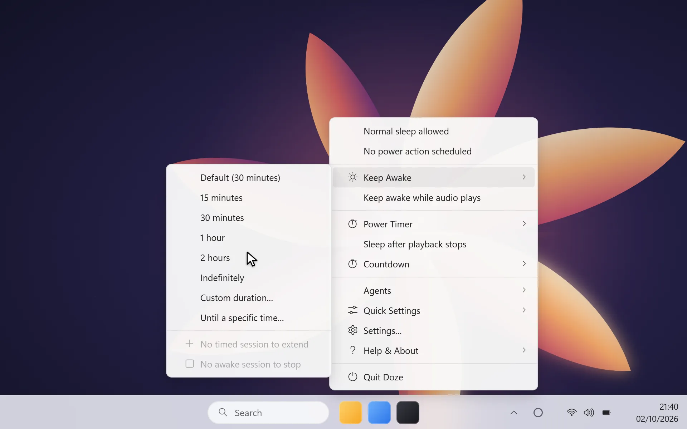
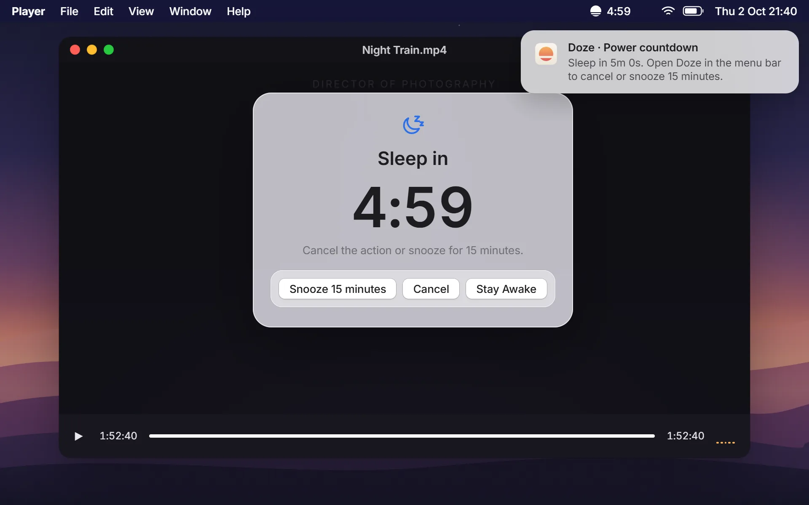
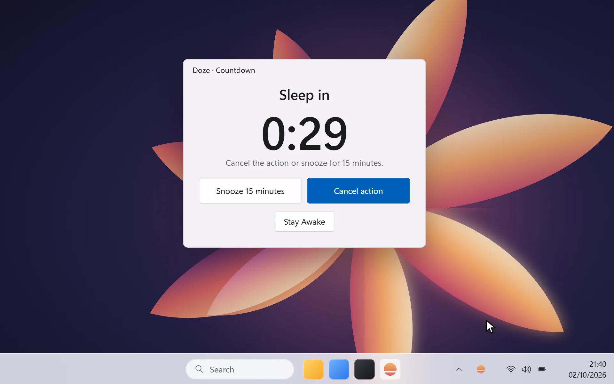

<p align="center">
  
</p>

<h1 align="center">Your computer knows when it's bedtime.</h1>

<p align="center">
  Keep your Mac or PC awake while the important things finish. Then let it sleep, with a warning you can cancel.
</p>

<p align="center">
  <a href="https://getdoze.app">Website</a> ·
  <a href="https://github.com/fayeed/doze/releases/latest">Latest release</a> ·
  <a href="https://github.com/fayeed/doze/issues">Report an issue</a> ·
  <a href="LICENSE.md">MIT License</a>
</p>

<p align="center">
  <a href="https://github.com/fayeed/doze/releases/latest/download/Doze-macos-universal.dmg">Download for macOS</a> ·
  <a href="https://github.com/fayeed/doze/releases/latest/download/Doze-windows-x64-setup.exe">Download for Windows</a>
</p>

<p align="center">
  <a href="apps/web/public/media/macos/hero.mp4"></a>
  <a href="apps/web/public/media/windows/hero.mp4"></a>
</p>

<p align="center"><em>At home in your menu bar or system tray. Click either preview to watch the short demo.</em></p>

<p align="center">
  <a href="apps/web/public/media/macos/hero.mp4">Watch the macOS demo</a> ·
  <a href="apps/web/public/media/windows/hero.mp4">Watch the Windows demo</a>
</p>

## A calmer way to manage power

Doze gives you a simple, visible way to decide when your computer stays awake and when it can rest. Start a session for a render, download, presentation or coding agent, and Doze releases its wake request as soon as the session ends.

- **Keep Awake:** choose a duration, set an end time, or stay awake indefinitely.
- **Power Timer:** schedule Sleep, Shut down, Hibernate, Lock or Display Off.
- **After Playback:** arm it before watching; after playback ends, Doze waits for silence and inactivity before showing the final warning.
- **A warning you control:** every power action has a countdown you can cancel, snooze or dismiss with Stay Awake.
- **For coding agents:** connect an MCP client or use the command line to keep the computer awake while work runs.
- **Native on both platforms:** a macOS menu bar app and a Windows tray app, with native settings and countdown windows.

<p align="center">
  <a href="apps/web/public/media/macos/after-playback.mp4"></a>
  <a href="apps/web/public/media/windows/final-warning.mp4"></a>
</p>

<p align="center"><em>After Playback waits for a quiet, idle computer. The final warning always gives you a chance to stay awake.</em></p>

## Private by design

Doze works locally. It has no account, telemetry or ads. Playback monitoring checks system audio activity; it never records or sends audio. Preferences and optional diagnostic logs stay on your computer.

## Clypy, from the same maker

<p>
  
  <strong>Your clipboard, with a memory.</strong><br />
  Clypy keeps your copied text, links, code, images and more easy to find across Mac, Windows, Linux, iPhone and Android. Search your history, capture clips from your phone, and sync paired devices with end-to-end encryption.
</p>

<p><a href="https://clypy.app">Meet Clypy →</a></p>

## Install

Download the latest release for your computer:

- [macOS 13 Ventura or later · Universal for Apple Silicon and Intel](https://github.com/fayeed/doze/releases/latest/download/Doze-macos-universal.dmg)
- [Windows 11 · x64 installer](https://github.com/fayeed/doze/releases/latest/download/Doze-windows-x64-setup.exe)

New releases are built for Windows and macOS and published together from a version tag. See [the release guide](docs/releases.md) for the workflow and macOS signing setup.

## For developers

### Requirements

- Node.js 22 or newer and pnpm 10 or newer
- Rust 1.88 or newer and Cargo
- Windows: Microsoft C++ Build Tools with **Desktop development with C++**, plus .NET 8
- macOS: Xcode with the macOS 26 SDK

### Run locally

```sh
pnpm install
pnpm dev
```

This starts the website and the desktop app. Run only one with `pnpm dev:web` or `pnpm dev:desktop`.

| Command | What it does |
| --- | --- |
| `pnpm build` | Build the website and desktop workspace |
| `pnpm lint` | Check the website and Rust code |
| `pnpm test` | Run workspace tests |
| `pnpm release --build-only` | Build a local installer without publishing |
| `pnpm release:test` | Check release planning and installer selection |

### Workspace

- `apps/desktop` — Tauri desktop app, Rust engine, and native Windows/macOS interfaces
- `apps/web` — product website and platform-specific demo scenes
- `packages/brand` — shared visual identity and product details
- `packages/config` — shared TypeScript configuration
- `skills/doze` — companion skill for authorized Doze sessions from coding agents

For MCP setup, command-line jobs, platform details and verification notes, see the [desktop guide](apps/desktop/README.md). See [QA notes](apps/desktop/QA.md) for current platform validation.

## Community and security

Contributions are welcome. Please read [CONTRIBUTING.md](CONTRIBUTING.md) before opening a pull request. Report bugs and suggest improvements through the [issue tracker](https://github.com/fayeed/doze/issues). Never post security vulnerabilities publicly; follow [SECURITY.md](SECURITY.md) to report them privately.

Doze is released under the [MIT License](LICENSE.md).

---

<p align="center">
  Made with care by <a href="https://github.com/fayeed">Fayeed Pawaskar</a> ·
  <a href="https://getdoze.app">getdoze.app</a> ·
  <a href="https://clypy.app">clypy.app</a>
</p>
